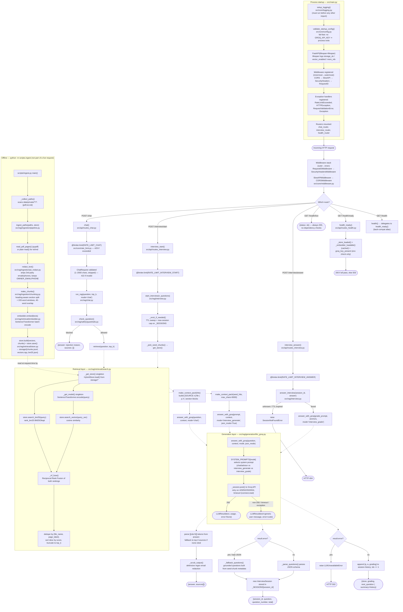

# PersonaQuery — System Flowchart

Visual companion to [`code-flow.md`](./code-flow.md), which explains every box below in prose with
exact function/file references. Read this diagram top-down: process startup, then the middleware
every request passes through, then each of the four route groups, then the two shared layers
(retrieval, Groq generation) that the routes call into, and finally the offline ingestion pipeline
that populates the data those routes read from.

## Legend

| Shape | Meaning |
|---|---|
| Rounded rect `(["..."])` | Terminal response returned to the HTTP client |
| Diamond `{"..."}` | Branch point |
| Solid arrow | Direct function call |
| Dotted arrow | Call into / return from one of the two shared subgraphs (retrieval, generation), or the ingestion pipeline handing off to storage |
